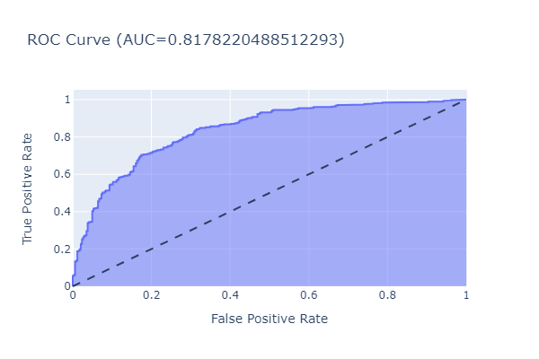

# Quality Complaints Classification

ML model to classify whether a quality complaint is valid or not. The model is trained on a **fictional** dataset of quality complaints and their corresponding labels.

## Dataset

The **fictional** dataset consists of quality complaints and their corresponding results. The results are binary, where `1` indicates a **valid** complaint and `0` indicates an **invalid** complaint.
The data columns are as follows:
- `plant`: The plant where the product was made
- `storage`: The storage location of the product
- `quantity`: The quantity of the product
- `number_defects`: The number of defects in the product
- `sales`: The volume of sales
- `location`: The location of the complaint
- `hybrid`: The hybrid (commercial name) of the product
- `treatment`: The treatment of the product
- `reason`: The reason for the complaint
- `result`: The result of the complaint (1 for valid, 0 for invalid)

## Histograms

## Statistical tests
### Chi-Squared Test

The Chi-Squared Test of Independence is used to determine if there is a significant association between two categorical variables. The null hypothesis (H0) is that the variables are independent, and the alternative hypothesis (H1) is that the variables are dependent.

The formula is:
$$\chi^2 = \sum \frac {(O - E)^2}{E}$$

Where $O$ is the observed frequency and $E$ is the expected frequency.

### Cramer's V
Cramer's V is a scaled version of the chi-squared test statistic $\chi^2$, which ranges from 0 to 1. It is used to measure the strength of association between two nominal variables. The value of Cramer's V ranges from 0 to 1, where 0 indicates no association between the variables, and 1 indicates a strong association between the variables.

The formula is:
$$Cramer's V = \sqrt{\chi^2/(n\cdot(k-1))}$$

Where $\chi^2$ is the chi-squared test statistic, $n$ is the number of observations, and $k$ is the number of categories in the contingency table.

## Models Development

The dataset is split into training and testing sets, with 80% of the data used for training and 20% for testing. The following models are trained on the dataset:
- LightGBM
- Random Forest

The models are evaluated using the following metrics:
- Accuracy
- Roc-Auc

### LightGBM

LightGBM is a gradient boosting framework that uses tree-based learning algorithms. It is designed for speed and efficiency and is widely used in machine learning competitions.

## Results

The results are as follows:

| Model        | Accuracy | Roc-Auc |
|--------------|----------|---------|
| LightGBM     | 0.766     | 0.817    |
| Random Forest| TO-DO     | TO-DO    |

